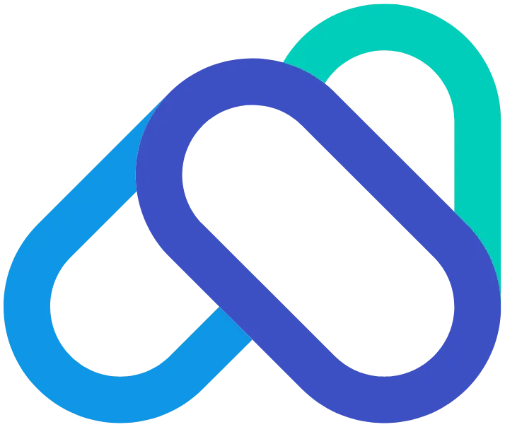

<div align="center">



# Bio Page Hype Tech

### Uma bio link‑in‑bio de elite, 9:16, para profissionais de tecnologia

**Minimalista + Premium + Cyberpunk** — em um único arquivo HTML, sem build, sem dependências.

<br/>


<br/><br/>

[](.)
[](.)
[](.)
[](#-licença--créditos)

<br/>

[**🔱 Ver demo / domínio**](https://bru.ia.br) · [**🍴 Fazer fork**](https://github.com/brunopelatieri/bio-page-hype-tech/fork) · [**⭐ Dar uma estrela**](https://github.com/brunopelatieri/bio-page-hype-tech)

</div>

---

## ✨ Por que esta Bio é diferente

A maioria das "link in bio" são genéricas. Esta foi desenhada como **marca pessoal de alto nível**: comunica automação inteligente, arquitetura enterprise e desenvolvimento full stack com tipografia futurista, profundidade visual e brilho controlado — pronta para usar como **bio, banner ou capa de perfil**.

- 🎯 **Formato 9:16 vertical** — perfeito para mobile, stories e capas.
- 🧊 **Três estéticas em equilíbrio** — clareza minimalista, acabamento premium (vidro/holografia) e energia cyberpunk (rede de dados neon).
- 🧠 **Conteúdo em 3 camadas (regra de Pareto)** — quem só quer contato, quem lê o essencial e quem quer se aprofundar, todos atendidos sem cansar.
- ⚡ **Um único `index.html`** — CSS e JS embutidos, **zero frameworks**, abre só dando duplo‑clique.
- 🔍 **SEO de excelência** — JSON‑LD `@graph` (Person + WebSite + ProfilePage), Open Graph, Twitter Cards, `<h1>` solitário e hierarquia semântica estrita.
- 🪶 **Performance & acessibilidade** — `prefers-reduced-motion`, `width`/`height` em imagens (CLS < 0.1), foco visível e ARIA.
- 🌌 **Fundo vivo** — rede de partículas conectadas em `<canvas>`, auroras em movimento e grid técnico — tudo desligável para quem prefere menos movimento.

---

## 🚀 Comece em 3 minutos

### 1. Clone ou faça o fork

```bash
git clone https://github.com/brunopelatieri/bio-page-hype-tech.git
cd bio-page-hype-tech
```

### 2. Veja rodando

Basta **abrir o `index.html`** no navegador. Para um preview com servidor local:

```bash
# Python
python -m http.server 8080
# ou Node
npx serve .
```

### 3. Torne sua

| O que trocar | Onde |
|---|---|
| **Suas imagens** (foto, logo, favicon, og) | `public/images/` |
| **Nome, cargo, tagline** | seção `<header>` / `.hero` no `index.html` |
| **Pilares, stats e "Sobre"** | seções `O que eu faço`, `Sobre` |
| **Links e redes** | seções `Conecte-se` e `Redes` |
| **SEO** (title, description, JSON‑LD, OG/Twitter) | `<head>` e o bloco `application/ld+json` |
| **Cores da marca** | variáveis CSS `:root` (`--indigo`, `--blue`, `--teal`) |

---

## 🎨 Sistema de design

```css
:root {
  --indigo: #3C50C4;  /* primária / dominante */
  --blue:   #1094E4;  /* secundária */
  --teal:   #00CCB8;  /* acento */
  --magenta:#b14cf0;  /* neon cyberpunk, com moderação */
}
```

- **Tipografia:** Space Grotesk (display, técnica/engenheirada) + Plus Jakarta Sans (corpo, alta legibilidade).
- **Layout:** coluna 9:16 centralizada, glassmorphism, gradientes e glow controlado.

---

## 🔍 SEO embutido

- **JSON‑LD `@graph`** com entidade `Person` completa (`sameAs` de todas as redes), `WebSite` e `ProfilePage` — otimizado para Google SGE / AI Overviews.
- **Open Graph** + **Twitter `summary_large_image`**.
- **Hierarquia on‑page saneada:** um único `<h1>`, descida `<h2>` → `<h3>`, e `alt` ricos em palavras‑chave em todas as imagens.

> Lembre de ajustar `canonical`, `og:url` e as URLs absolutas de imagem para o **seu** domínio.

---

## 🌐 Deploy

Funciona em qualquer host estático — **GitHub Pages, Cloudflare Pages, Netlify, Vercel** ou sua própria VPS. É só servir a raiz do projeto (com a pasta `public/` acessível).

---

## 🤝 Licença & créditos

Distribuída sob **licença MIT** — use, modifique e publique à vontade, inclusive comercialmente. **Há apenas uma condição:** mantenha os créditos.

> 💙 **Mantenha o rodapé de crédito da Bio** (ou um equivalente visível): link para este repositório + autoria de **Bruno Goulart** e **Claude Opus 4.8**.

### Autoria

Este projeto nasceu de uma colaboração humano + IA:

- **🧠 Concepção, direção criativa e AI Prompt Engineering:** **[Bruno Pelatieri Goulart](https://brunogoulart.com.br)** — *AI Automation Specialist & Full Stack Developer Sênior.* A engenharia de prompt estruturada, o contexto profissional e a visão de marca que guiaram cada decisão são dele.
- **🤖 Execução, arquitetura de código e design:** **Claude Opus 4.8 (Anthropic)** — um feito notável de engenharia da humanidade, que transformou o prompt em uma peça única, sofisticada e production‑ready com maestria.

**Gostou desta Bio?** Faça um **fork** ou **clone** e adapte para você:
👉 **https://github.com/brunopelatieri/bio-page-hype-tech**

Só não esqueça: **o crédito fica para os dois autores — Bruno Goulart + Opus 4.8.** 🙌

---

> ### ☕ Curtiu e quer fazer a boa?
> Uma cervejinha sempre cai bem. Se esta Bio te ajudou ou você vai usar, considere um PIX — totalmente opcional, mas muito bem-vindo. 🍺
>
> **PIX (telefone/WhatsApp):** `19 99249 6598`
> **Favorecido:** Bruno Pelatieri Goulart

---

<div align="center">

### Conecte-se com o autor

[](https://brunogoulart.com.br)
[](https://github.com/brunopelatieri)
[](https://www.linkedin.com/in/bruno-pelatieri-goulart/)
[](https://x.com/brunopelatieri)
[](https://wa.me/5519992496598)

<br/>

*"Unindo 18 anos de engenharia com a inteligência do futuro — construindo hoje o que o mercado precisará amanhã."*

⭐ **Se curtir, deixe uma estrela no repositório — ajuda muito!**

</div>
